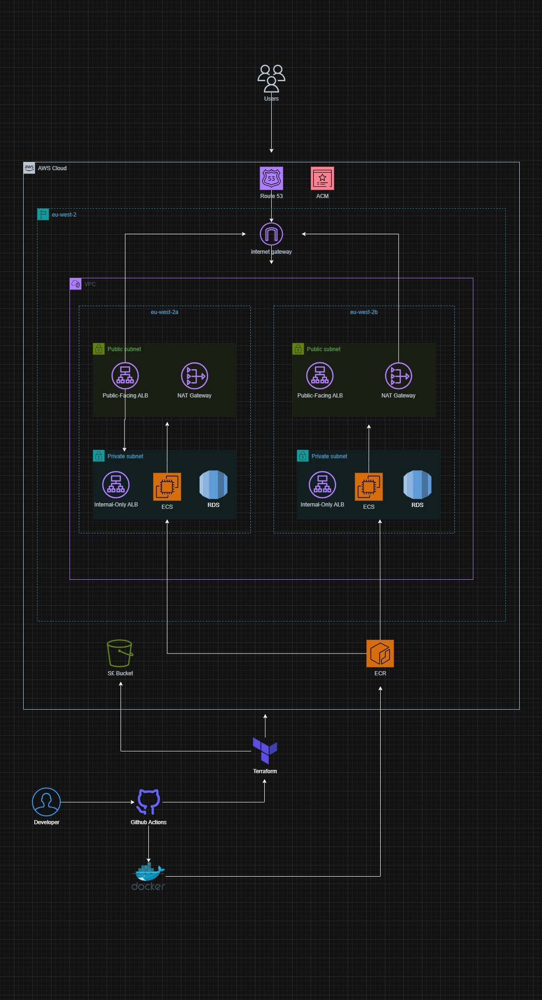
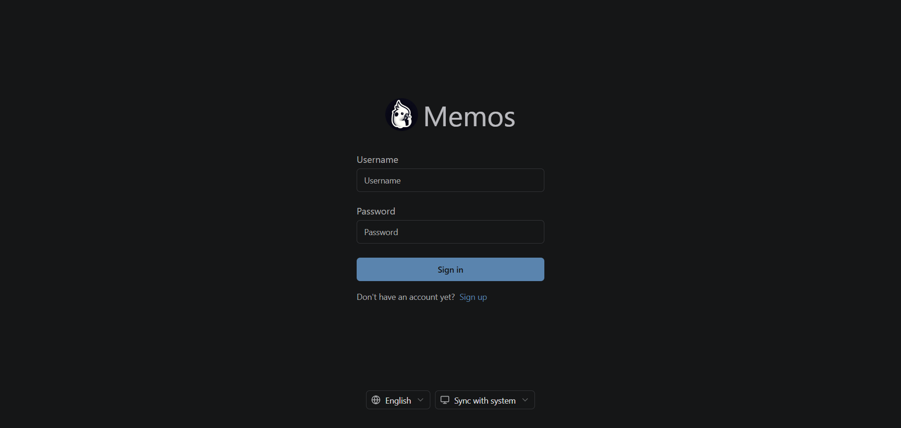
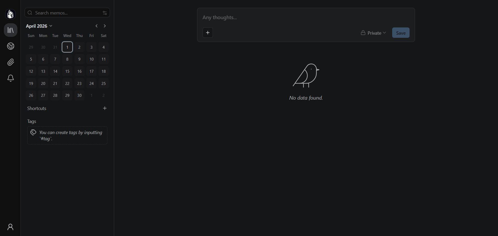
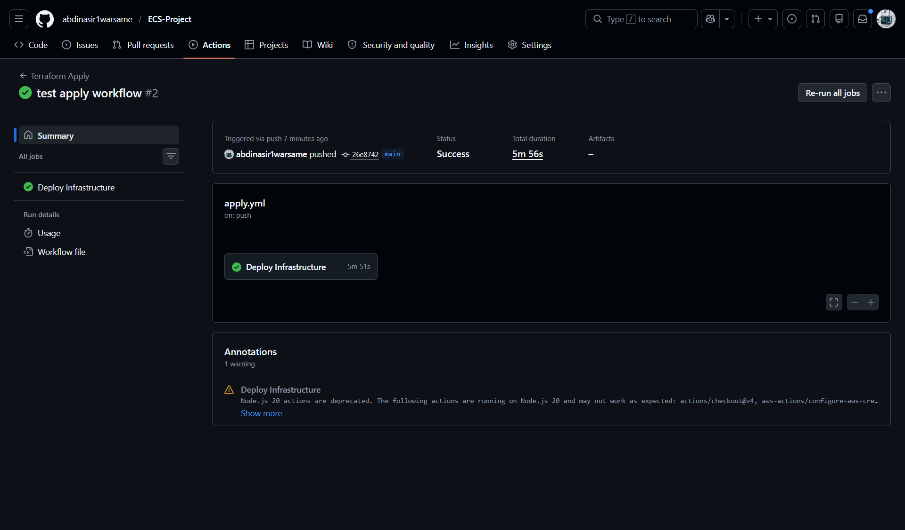
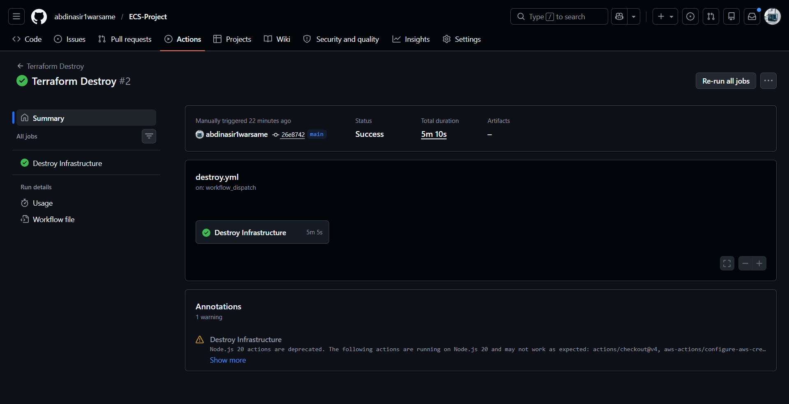

# Memos on AWS ECS Fargate

A complete, production-style deployment of the open-source note-taking platform Memos on AWS. The application is containerized with Docker, infrastructure is defined as code with Terraform, and a CI/CD pipeline automates builds and deployments.

Project URL: https://memos-app-ecs.com (deployed on demand)

---

## Table of Contents

- [Overview](#overview)
- [Key Highlights](#key-highlights)
- [Architecture](#architecture)
- [Key Features](#key-features)
- [Requirements](#requirements)
- [Folder Structure](#folder-structure)
- [Run Locally](#run-locally)
- [Deploying to AWS](#deploying-to-aws)
- [Screenshots (Application + Workflows)](#screenshots-application--workflows)
- [Key Technical Details](#key-technical-details)
- [Future Improvements](#future-improvements)
- [Tech Stack](#tech-stack)

---

## Overview

This project deploys Memos into AWS as a secure, scalable, and highly available platform using modern DevOps practices.

### Three-Tier Architecture

- **Presentation Tier** -- Application Load Balancer (ALB) with HTTPS termination
- **Application Tier** -- Two separate ECS Fargate services: frontend (React + Nginx) and backend (Go)
- **Data Tier** -- Amazon RDS PostgreSQL in private subnets, with credentials stored in AWS Secrets Manager

Everything is provisioned using Terraform and deployed through a GitHub Actions CI/CD pipeline.

---

## Key Highlights

- Infrastructure as Code with Terraform across networking, compute, load balancing, security, and data services
- Multi-stage Docker builds for efficient frontend and backend images
- Non-root containers for improved runtime security
- Internal backend design with no public exposure for backend services
- Secrets stored in AWS Secrets Manager
- Terraform state protected with S3 backend and DynamoDB locking
- GitHub Actions CI/CD with OIDC authentication and no long-lived AWS credentials
- Multi-AZ deployment for high availability

---

## Architecture



### Key Network Design

- VPC with public subnets for the ALB and private subnets for ECS tasks and RDS
- Security groups enforce strict traffic flow: Internet → ALB → ECS tasks → RDS
- NAT Gateways allow private resources to pull images from ECR and send logs to CloudWatch

### Traffic Flow

User → Route 53 → Public ALB (HTTPS) → Frontend ECS → Internal ALB → Backend ECS → RDS

### Availability Model

- Multi-AZ across eu-west-2a and eu-west-2b
- Public subnets contain the public ALB and NAT Gateways
- Private subnets host the internal ALB, ECS tasks, and RDS
- NAT Gateways allow private resources to pull images from ECR and send logs to CloudWatch

---

## Key Features

### Infrastructure

- VPC with public and private subnets across 2 AZs
- Two ALBs: public (HTTPS) and internal (HTTP)
- ECS Fargate cluster with two services: frontend and backend
- ECR repositories for both images
- ACM certificate with DNS validation
- Route 53 A record for memos-app-ecs.com pointing to the public ALB
- RDS PostgreSQL with credentials in Secrets Manager
- Security groups with least-privilege access
- IAM roles for ECS tasks and GitHub Actions (OIDC)
- CloudWatch logging for both services
- S3 backend and DynamoDB locking for Terraform state

### CI/CD

- Infrastructure workflow (`terraform-apply.yml`) runs on push to main or manually
- Destroy workflow (`terraform-destroy.yml`) is manual only

### Application

- Multi-stage Docker builds: frontend (Node.js → Nginx), backend (Go → Alpine)
- Health check endpoint: `/healthz` for the load balancer
- HTTPS with a custom domain
- Persistent database storage

---

## Requirements

Before running or deploying, ensure you have:

| Requirement                                               | Purpose                                                        |
| --------------------------------------------------------- | -------------------------------------------------------------- |
| Docker                                                    | Build and run the Memos image locally and in CI                |
| Terraform 1.6 or later                                    | Provision and manage AWS infrastructure                        |
| AWS CLI                                                   | Configure credentials; optional for local deploy and debugging |
| Git                                                       | Clone the repo and push to trigger workflows                   |
| GitHub account                                            | Host the repo and run GitHub Actions                           |
| AWS account                                               | Deploy and manage AWS resources (ECS, ECR, ALB, VPC, RDS,      |
| Route 53, ACM, S3, DynamoDB, CloudWatch, Secrets Manager) |

For CI/CD you will also need:

- An S3 bucket and DynamoDB table for Terraform state, created before the first apply
- A Route 53 hosted zone for your domain so ACM can validate the certificate using DNS
  validation
- A GitHub Actions secret named `AWS_ROLE_ARN` for OIDC authentication, used by both workflows
  (Terraform Apply and Terraform Destroy)

---

## Folder Structure

```text
ECS_PROJECT/
├── docker/
│   ├── frontend.Dockerfile
│   ├── backend.Dockerfile
│   └── nginx.conf
├── terraform/
│   ├── main.tf, provider.tf, secrets.tf, variables.tf, outputs.tf
│   └── modules/          # vpc, security-groups, iam, ecr, rds, alb, ecs-cluster,
ecs, ecs-service, route-53
├── .github/workflows/
│   ├── terraform-apply.yml
│   └── terraform-destroy.yml
├── docker-compose.yml
└── README.md
```

---

## Run Locally

Prerequisites: Docker Desktop

Run with Docker Compose:

```bash
git clone https://github.com/abdinasir1warsame/ECS-Project
cd ECS-Project
docker-compose up
```

Access the app at http://localhost

---

## Deploying to AWS

### 1. Bootstrap Terraform state backend (one time)

Create an S3 bucket and a DynamoDB table for locking. The names must match `provider.tf`.

### 2. Store database secret in AWS Secrets Manager

```bash
aws secretsmanager create-secret --name prod/memos/db --secret-string
'{"db_name":"memosdb","username":"memos_user","password":"YourStrongPassword!","port":5432}'
--region eu-west-2
```

### 3. Configure GitHub Actions secret

Add `AWS_ROLE_ARN` with value `arn:aws:iam::843036590237:role/github-actions-dev-role`
in repository settings.

### 4. Deploy infrastructure

Push to `main` to trigger the Terraform Apply workflow automatically, or run it manually
from the Actions tab.

## Screenshots (Application + Workflows)

Application when deployed at https://memos-app-ecs.com

| Login Page                                            | Dashboard (after login)                              |
| ----------------------------------------------------- | ---------------------------------------------------- |
|  |  |

### CI/CD Workflows

| Terraform Apply (success)                            | Terraform Destroy (manual)                             |
| ---------------------------------------------------- | ------------------------------------------------------ |
|  |  |

---

## Key Technical Details

### Docker Build Process

Frontend: Multi-stage build where the Node.js builder compiles the React app, and
Nginx serves the static files on port 8080.

Backend: Multi-stage build where the Go builder compiles the binary, and the Alpine
runtime runs it with a non-root user on port 8081.

Both images are optimized with layer caching and a minimal final size.

### State Management

Terraform state is stored in S3 (`terraform-state-nasir`) with DynamoDB locking (`terraform-locks`).

Automatic state refresh occurs before plan and apply.

### Security

- Non-root containers for both services
- Private subnets for ECS tasks and RDS
- Security groups enforce least-privilege rules
- GitHub Actions uses OIDC with no long-lived AWS credentials

---

## Future Improvements

- **Add VPC endpoints for ECR, S3, and CloudWatch** -- Replace NAT Gateways to reduce costs and keep private subnets truly private.
- **Automate database secret rotation** -- Configure AWS Secrets Manager to rotate RDS credentials automatically without downtime.
- **Create CloudWatch dashboards** -- Monitor ECS task health, ALB 5XX errors, and RDS CPU, and set up alarms with SNS notifications.
- **Use Terraform workspaces** -- Manage separate environments (dev, staging, prod) from the same codebase.
- **Implement blue/green deployments** -- Use ECS CodeDeploy for zero-downtime updates and easier rollbacks.
- **Add auto-scaling to ECS services** -- Scale based on CPU/memory metrics or ALB request count.
- **Enable RDS Multi-AZ** -- Deploy a standby replica for high availability in production.
- **Schedule automated RDS snapshots** -- Run daily backups with a retention policy for disaster recovery.
- **Add security scanning to CI/CD** -- Integrate Trivy or Snyk to scan Docker images before pushing to ECR.

---

## Tech Stack

- Cloud: AWS (ECS Fargate, ECR, ALB, VPC, RDS, Route 53, ACM, S3, DynamoDB, CloudWatch, Secrets Manager)
- IaC: Terraform
- Containers: Docker
- CI/CD: GitHub Actions + OIDC
- Backend: Go
- Frontend: React + Nginx
- Database: PostgreSQL
